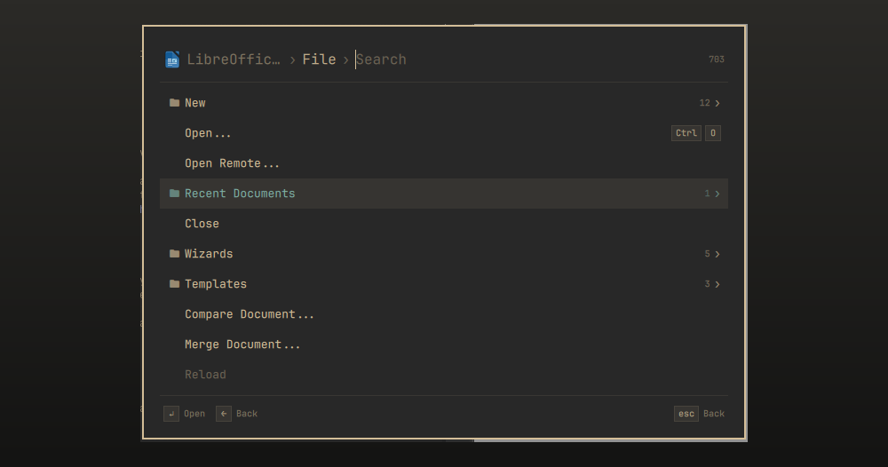
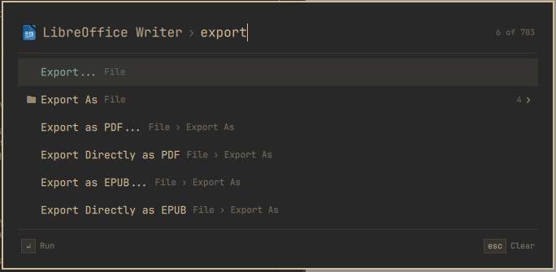
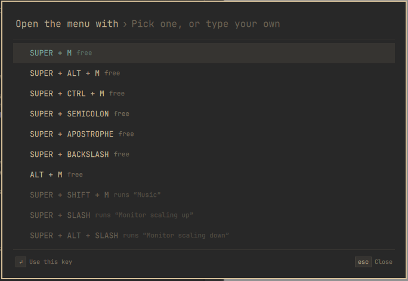

# Search Menu Items

An Omarchy plugin to search and run the menu items of the focused app from the
keyboard.

Press **Super + M** and the app's menu bar (File, Edit, View, Help and so on)
opens as an Omarchy menu, with each item's shortcut next to it. Type to search,
press Enter to run an item, or step into a menu to browse it.

Apps without a menu bar, such as Files and Ghostty, list their actions and
buttons instead.



## Install

Requires Omarchy 4.

```bash
omarchy plugin add https://github.com/MaNi4/omarchy-search-menu-items --enable
```

The plugin depends on `python-gobject` and `at-spi2-core`. Both are part of a
standard Omarchy install.

## Usage

| Key | Action |
|---|---|
| Super + M | Open the menu for the focused window |
| Any text | Search the current menu and everything inside it |
| Up, Down, Page Up, Page Down | Move the selection (also Ctrl+N / Ctrl+P and Ctrl+J / Ctrl+K) |
| Enter | Run the selected item, or open the selected menu |
| Right, Tab | Open the selected menu |
| Left, Backspace, Shift+Tab | Go back one menu |
| Esc | Clear the search, then go back, then close |

Search results show which menu each item belongs to. Searching for `pdf` in
LibreOffice Writer, for example, finds "Export as PDF..." under File > Export
As.



When a window has several panes with the same buttons, each button shows the
title of its pane and is found by it: `graph more`. Panes with the same title
are numbered: Welcome, Welcome 2.

Items appear in the same order as in the app. A tick marks an item that is
switched on. Items that are currently unavailable are dimmed and cannot be run.

## Changing the shortcut

If Super + M is already in use, the plugin does not override it. You get a
notification instead. Click it to choose from a list of free shortcuts, or type
your own, for example `super + alt + k`. The list shows whether a shortcut is
free and, if not, what it is bound to. Case and spacing do not matter:
`super+alt+k` and `SUPER + ALT + K` are the same shortcut.



You can open the same list at any time:

```bash
omarchy-shell shell summon mani4.search-menu-items '{"setup": "hotkey"}'
```

Your choice is saved to `~/.config/omarchy/extensions/search-menu-items.json`.
You can also edit this file directly; changes apply as soon as you save it.

```json
{ "hotkey": "SUPER + ALT + M" }
```

Set `"hotkey"` to an empty string if you prefer to bind the menu yourself. This
command opens it:

```bash
omarchy-shell shell toggle mani4.search-menu-items '{}'
```

Pass `'{"query": "export"}'` instead of `'{}'` to open the menu with a search
already filled in.

## App support

The plugin can only show what an app makes available, so results vary:

| App | What is listed |
|---|---|
| Apps with a menu bar, including LibreOffice, Kdenlive, Xournal++ and most GTK 3 and Qt apps | The full menu bar, with shortcuts |
| GTK 4 apps without a menu bar, such as Files and Ghostty | App actions (New Tab, Preferences and so on) and the window's buttons |
| Other apps without a menu bar, such as Pinta and Firefox-based browsers | The window's buttons |
| Chromium and Electron apps, such as Obsidian and VS Code | Nothing by default. If the app is started with a flag (see below), the buttons of the interface, and the menus they open, with shortcuts where the app shows them |

### Accessibility support

Most toolkits only expose their menus when accessibility support is enabled,
and it is off by default. If an app shows no items for this reason, the menu
offers to enable it. Accepting sets the desktop-wide setting
`org.gnome.desktop.interface toolkit-accessibility` to `true`; nothing else is
changed, and the Uninstall section shows how to turn it off again. Apps that
are already running have to be restarted before their menus appear.

### Limitations

- **Several windows of a GTK 4 app.** These apps expose per-window actions such
  as New Tab and Undo separately for each window, without indicating which
  window is focused. When more than one window is open, these actions are
  listed but dimmed, because running one could affect the wrong window. App-wide
  actions and the focused window's buttons still work. With a single window
  there is no restriction.
- **Windows with identical titles.** If two windows of the same app have the
  same title, for example two Files windows showing the same folder, the plugin
  cannot tell which one is focused. Their items are listed but dimmed.
- **Chromium and Electron apps.** Started the usual way, these expose nothing,
  so the menu is empty. They have no menu bar on Linux, and their menus are
  drawn only when opened, so there is nothing to read in advance. Starting
  them with `--force-renderer-accessibility` makes the buttons of their
  interface available, for example New Tab, Reload and Extensions in
  Chromium. To set the flag permanently, add it
  on its own line to `~/.config/chromium-flags.conf` for Chromium, to
  `~/.config/obsidian/user-flags.conf` for Obsidian installed from the Arch
  package, or to `~/.config/code-flags.conf` for VS Code installed from
  `visual-studio-code-bin`, and restart the app. The menu says so when an app
  of this kind shows nothing.

  In these apps a menu such as More options in Obsidian, or File in VS Code,
  only exists once its button is pressed. Choose the button and the plugin
  opens the menu in the app and lets you step into it, sub-menus included.
  Going back closes it again, by sending the window an Escape key. Its items
  are not part of a search before that. A button that opens a dialog or
  nothing at all is simply run. Shortcuts are shown where the app writes them
  next to an item, as VS Code does.

  VS Code turns on its screen reader mode with the flag; set
  `"editor.accessibilitySupport": "off"` to keep the editor as it was.

The bottom line of the menu explains why a dimmed item cannot be run when the
reason is one of the above.

## Uninstall

```bash
omarchy plugin remove mani4.search-menu-items
rm -f ~/.config/omarchy/extensions/search-menu-items.json
```

The shortcut is removed together with the plugin. If you enabled accessibility
support through the plugin and want to turn it off again:

```bash
gsettings set org.gnome.desktop.interface toolkit-accessibility false
```

## How it works

Nothing runs in the background. `Service.qml` registers the shortcut in the
running Hyprland session with `hyprctl eval`, without editing any config file,
and registers it again after each config reload, because Hyprland drops runtime
bindings when it reloads.

Opening the menu starts `bin/search-menu-items`, which exits when the menu
closes. It collects items for the focused window from three sources:

1. The menu bar in the accessibility tree (AT-SPI), the interface toolkits use
   to describe their menus to screen readers.
2. The actions a GTK app exports over D-Bus (`org.gtk.Actions`).
3. The window's buttons, if the app has no menu bar. Page content is ignored,
   except in Electron apps, where the page is the entire interface.

When a button in such an app is chosen, the reader presses it and looks at
what the page has drawn since: something the page marks as a menu (VS Code),
or a new layer over the page that holds only things to click (Obsidian).

The accessibility tree is read over D-Bus one menu level at a time, with all
calls for a level sent together rather than one after another. This keeps large
menus fast: the 700 items of LibreOffice Writer are read in about 0.3 seconds.
The names of the top-level menus are sent first, so the menu can open before
the rest has been read.

`SearchMenuItems.qml` draws the menu, `Model.js` decides which rows to show for
the current menu and search text, and `Hotkey.js` handles the shortcut. The
selected item is run by the same `bin/search-menu-items` process, shortly after
the menu closes, so that any dialog the item opens appears on top.

## Development

```bash
cd ~/.config/omarchy/plugins/mani4.search-menu-items
bin/search-menu-items --print           # list the items of the focused window
bin/search-menu-items --print --debug   # also show where they came from and timings
python3 tests/test_reader.py            # tests for bin/search-menu-items
node tests/run.js                       # tests for Model.js and Hotkey.js
```

## License

MIT
